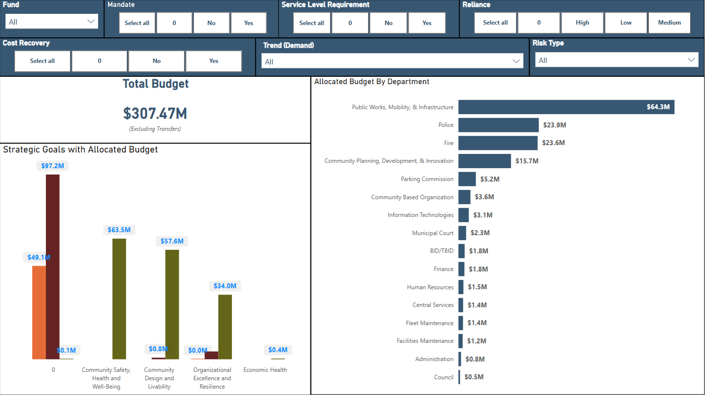

# 🏛️ City of Missoula Budget Capstone Project 🏛️


## Overview
This repository contains the capstone project for the City of Missoula Finance Department, supported by Mayor Andrea Davis. The goal is to enhance the City's priority-based budgeting and program transparency through structured data cleaning and the creation of a centralized Power BI dashboard.

By combining budget data and program-level survey responses, this tool enables better strategic planning and decision-making by elected officials and city leadership.


## Project Structure

The repository is organized as follows: 

```
CityofMissoulaBudgetCapstone/
│
├── assets/                                                 # Images and visuals used for the entire project
│   ├── clean_program_inventory_column_names.png
│   ├── cleaned_expend_preview.png
│   ├── cleaned_program_inventory.png
│   ├── colab_upload_files.png
│   ├── colab_runtime.png
│   ├── dashboard_view_01.png
│   ├── dashboard_view_02.png
│   ├── expend_preview_preclean.png
│   ├── program_inventory_internal_data_collection.pdf      # PDF version of FY24 Internal Data Collection Survey
│   ├── program_inventory_preview_preclean.png
│   ├── sharepoint_library_view.png
│   └── three_ps_niekamp.txt                                # Weekly Project Updates Log
│
├── cleaned_outputs/                                        # Finalized data used by the app + dashboard
│   ├── cleaned_expenditure_status.csv
│   └── cleaned_program_inventory.csv
│
├── streamlit_app                                           # Digital product; internal training tool for city
│   ├── assets/
│   |    └── welcome_missoula.jpg
│   ├── digital_product_internal_tool.py
│   ├── pages.py
│   ├── requirements.txt
│   ├── style.py
│   └── utils.py
|
├── data/                                                   # Raw internal City of Missoula data (ignored)
│   └── *.xlsx
│
│── citydata_01_cleaning.ipynb                              # Narrated version of the data cleaning process by step
│── citydata_02_exploratory.ipynb                           # Narrated version of the data analysis process by step
├── README.md                                               # You’re reading it!
└── .gitignore                                              # Clean Git tracking
```


## Data Sources and Overview
- FY24_Expenditure_Status.xlsx - Budget account-level data with activity, department and objective codes. Export from Tyler Edens.
- Program_Inventory_Internal_Data_Collection.xlsx - Survey-based program intake / inventory that includes attributes about specific programming (mandates, trends, risks, etc.) Export from Workiva. 

These files are exported from the City of Missoula's Workiva (Wdesk) instance and financial software accordingly. 


## Methodology

The City of Missoula focuses on priority based budgeting practices. This is essential given that many programs are required by various factors. Because this topic is easily misconstrued, here is a summary of frequent terminology used in this project (More detailed definitions available in Appendicies). 

### Key Definitions
**Program**: City-funded service or function with a 6-digit code, representing a specific output or public-facing activity. 

**Mandate**: Legally required (federal, state or court-appointed). Does not include contract-based or optional services. 

**Service Level Requirements (External)**: Rules imposed by external entities (ex., regulatory agencies), even if the program itself isn't mandated.

**Reliance**: Community dependence or risk of disruption if removed from the community. High reliance = wide usage, few alternatives, or critical outcomes. 

**Trend**: Indicates whether the program's demand is growing, stable, declining or evolving due to external factors. 

**Risk**: Assesses potential challenges in the next 1-3 years (ex., funding cuts, staffing issues, legal changes).

**Cost Recovery**: Indicates whether or not a program experiences any form of cost recovery meaning, a portion of program costs are offset by revenue sources.


### Extraction Process
**[Currently in progress of implementation]**
In order to begin a refreshed cycle of visualizing the City of Missoula's Program Inventory data, a City of Missoula employee will download data from both the Workiva Platform (Program Inventory Dataset) and Tyler Edens Platform (Expenditure Status Dataset) beginning January 1, 2024 through the current applicable year. Ensuring the dashboarding tool maintain accuracy for year over year comparisons. In all there will be two files; Expenditure Status and Program Inventory Internal Data Collection. 

These two files will be uploaded into the Sharepoint Site: ***"[Missoula PBI - City Program Inventory Budget Breakdown](https://cityofmissoulagcc.sharepoint.com/sites/MissoulaPBI/CPIBB/Forms/AllItems.aspx)"***. 

From this, the files will automatically undergo a cleaning and transformation process, as elaborated in the following section. 


### Cleaning & Transformation Process

All cleaning is conducted in Python using modular, documented functions that support automation and integration with the Power BI Platform. For a more comprehensive breakdown of each of the steps, please review the ```citydata_01_cleaning.ipynb``` in this repository. 


#### Steps Summary
**Step 1:** Import Libraries Used

```
pandas, numpy                   ## Data wrangling
openpyxl                        ## Excel file I/O
janitor                         ## Header normalization and chaining helpers
tqdm, re, os, chardet           ## Cleaning utilities
missingno, matplotlib.pyplot    ## EDA visual tools
```

**Step 2:** Define Cleaning Functions

Creating a set of helper functions reduced repetition and provides greater clarity, below are some notable functions used and an explanation of what they do. 

```
drop_unnamed_columns()          ## Removes Excel filler columns

clean_numeric_column()          ## Fixes trailing .0 artifacts

clean_identifiers()             ## standardizes key indentifiers and applies formatting

expand_multicolumn_headers()    ## Converts original clumped "Mandate" column into multiple structured column headers

apply_department_and_fund_mappings() ## easilty identified mappings for city codes

clean_program_inventory()       ## full cleaning pipeline for program inventory data

strip_whitespace_and_standardize() ## Cleans casing and trailing spaces

remove_trailing_underscores()   ## Final polish on column names
```

**Step 3:** Load Raw Files

Reads in both Excel exports using ```openyxl```


**Step 4:** Expenditure Status Filtering

Creates six individual filtering conditions on the Expenditure Status file; 
- Removes subtotal/blank rows
- Confirms numeric validity
- Retains specific row and column combinations


**Step 5:** Account Code Decomposition

Breaks out ```account_number``` within the Expenditure status data into:

```
fund_no,                ## related to four digit fund code

dept_no,                ## related to three digit department code

activity_code,          ## related to six digit unique activity codes

object_code,            ## related to three digit budget object code

sub_object_code         ## related to three digit sub budget object code
```


**Step 6:** Program Inventory Header Expansion

Converts wide format survey headers (e.g. "Mandate (E41, H41, E43)") into proper named fields


**Step 7:** Clean Program Inventory

Calls in our ```clean_program_inventory()``` function

Standardizes IDs (```fund, dept_no, activity```)

Fills empty responses with "blank" for BI compatibility


**Step 8:** Normalize Column Names

Converts all columns to ```snake_case``` using ```janitor.clean_names()```

Removes trailing _ characters

Applies across both program and revenue workbooks


**Step 9:** Validate Structure

```
missingno.matrix()           ## confirms data completeness

.describe() and .info()      ## checks used on each dataset
```

Spot checks confirm no corrupted rows or null-heavy fields


**Step 10:** Apply Final Mappings

Merges ```dept_map``` and ```fund_map``` for readability

Unmapped entries are labeled "unmapped" for visibility


**Step 11:** Export Cleaned Files

Final files are saved to cleaned_outputs/ for use in:
- Streamlit Hosted Internal Expenditure Status Training Tool
- Power BI Dashboard


## Streamlit Digital Product: Internal Training Tool
The Streamlit app allows the user to experience what it is like to be included in the budget planning process in the City of Missoula. Whether you are planning to run for a position on the City Council, aspire to be the Mayor or will be filling a supporting staff role - This tool educates understanding of budget tradeoffs by allocating funds across the four strategic goals; Community Design and Livability, Community Saftety Health and Well-Being, Organizational Excellence and Resilience, and Economic Health using priority-based budgeting practices.

Explore:
- Understanding how program risks, requirements and mandates reduce available budget
- Understanding how strategic goals align with priority-based budgeting
- Understanding the breakdown of what is included in all of the budgeted costs for a program. 

[Launch App (Streamlit Cloud)](https://expendituretrainingmt2025.streamlit.app/)

*View the Full Code:* [streamlit_app](https://github.com/breannanpr/CityofMissoulaBudgetCapstone/tree/main/streamlit_app)

[Leave a comment about your experience](https://docs.google.com/forms/d/e/1FAIpQLSdOltLVM-Sb7vrwDpKbwmf82047GzrqpWmDYE8fHGUFD-22lw/viewform?usp=header) with the training tool. 


## Raw Data to Power BI Pipeline
**[Currently in progress, will be adding more information to this section. Currently the process is as below]**

This partially manual and automatic data cleaning pipeline utilizes Google Colab as a data cleaning processor to host python code in an interactive environment for the employee carrying out the task. 

**1. Beginning Extracting the Raw Data Files**

Raw .xlsx files (Expenditure Status, Program Inventory) are extracted and saved within the employees desktop. 

From here, they will navigate to the [Program Inventory and Expenditure Data Cleaning Notebook](https://colab.research.google.com/drive/1d5DcpU9pPE3S6YncbMMwBcjf7saI8NgW?usp=sharing) in Google Colab. 


File format "Expenditure_Status.xlsx" for Expenditure Status. 

File Format: "Program_Inventory_Internal_Data_Collection.xlsx" for Program Inventory. 

**NOTE: It is essential that these file names are accurate for the integrity of the data cleaning process. Overwrite existing file when dropping them into the SharePoint Library.**

Once the up to date files are uploaded, step two will automatically begin the extraction, transformation / cleaning process and load the cleaned datasets into the green second folder located in the SharePoint Library. 

**2. Power BI Python Script**

*The Power BI Platform will:* 
- Extract the raw files directly from SharePoint Library
- Transform / Clean both raw data files, executing the same cleaning pipeline that is created here in this repository (/code/citydata_01_cleaning.py). 
- Load the cleaned, in-memory dataframes used for dashboard visualizations into the SharePoint Library 02_cleaned_outputs *green* folder. 

Once this process is complete, the dashboard should update to reflect the new data accordingly. 

**3. No Pre-Clean Required**

Users only need to upload raw files. The cleaning script takes care of the rest - cleaning, mapping, and shaping all the data in real-time. 


### Dashboard Features

The [Program Inventory and Expenditure Power BI Dashboard](https://app.powerbigov.us/view?r=eyJrIjoiMTYxNmYxYTgtYjhjZC00YjdhLTliOTItMDY3YmEzODY0ZTczIiwidCI6Ijc4MGM5OGZhLTc3ZDYtNGMwZi05NzJhLTM5YjQ5MGE0ZjY0MSJ9) will support: 
- Maximum filtering by fiscal year, fund, trend (demand), mandate, service level, risk type, cost recovery, and reliance. 
- Visual Summaries for: 
    - Strategic Goal Alignment
    - Budget by Program and Department
    - Understanding Mandated and Service Level Requirements 
    - Understanding Cost Breakdown by Capital, O&M, Personnel, Grant, Total Expenditures and Cost Recovery (%)




## Exploratory Analysis
The notebook [citydata_02_exploratory.ipynb](code/citydata_02_exploratory.ipynb) dives into the cleaned data to identify patterns, ensure data integrity, and inform both the app and dashboard. This step is essential for validating the success of the cleaning process and surfacing analytical insights before building visualizations.

**Step 1: Load Data**
Both cleaned CSVs are loaded from our ```cleaned_outputs``` file:
- cleaned_expenditure_status.csv
- cleaned_program_inventory.csv

✅ Column names and data types are verified

✅ Expected shapes: ~2,200 expenditure rows, ~375 program rows

✅ Structure aligns with expectations, no null or corrupted columns

**Step 2: Data Structure and Health Checks**
Used ```info()``` and ```.describe()``` to assess completeness and distributions.

Confirmed all key fields (like ```dept_no, adjusted_appropriation, strategic_goal```) are usable.

Found most columns to be consistent and free of missing data.

Visual null-check:
```
import missingno as msno
msno.matrix(df_programs)
```

This quickly confirms that most columns are complete and suitable for grouping and visualization.

**Step 3: Expenditure Trends**
Aggregated ```adjusted_appropriation``` by ```department``` to highlight high-spend orgs.

Identified which departments are driving the city’s core spending.
```
top_depts = df_expend.groupby('department')['adjusted_appropriation'].sum().sort_values(ascending=False)
top_depts.plot(kind='barh')
```

🟢 Findings: Several departments (e.g. Fire, Police, Public Works) dominate the budget allocation.

**Step 4: Strategic Program Review**
Explored how many programs aligned with citywide strategic goals

Grouped by ```strategic_goal_e66_name``` and ```risk_e93_type``` to understand complexity

Example:
```
df_programs['strategic_goal_e66_name'].value_counts().head(10)
```

🟡 Insight: Programs tied to housing and infrastructure were most common among strategic alignments.

**Step 5: Risk and Mandate Profiles**
Evaluated how many programs were mandated and how many were high-risk.

Compared cost/reliance of mandated vs. non-mandated programs.
```
sns.countplot(data=df_programs, x='mandate_e41_yn')
sns.countplot(data=df_programs, y='risk_e93_type')
```

🔴 Risk Areas Identified:
- Public health and grant-based programs showed higher exposure.
- High personnel costs often correlated with risk-heavy programs.

**Step 6: Program Cost Patterns**
Analyzed ```personnel_g27``` vs ```ftes_h36``` to find high-cost, low-staff programs.

Flagged outliers that might require further budgetary scrutiny.

```
sns.scatterplot(data=df_programs, x='ftes_h36', y='personnel_g27', hue='risk_e93_type')
```

💡 Pattern: Some strategic programs consume large personnel budgets without high FTE counts — signals for further review.

**Summary of Insights**
The cleaning pipeline was validated: no structural errors or major nulls.

Expenditure is concentrated among a few departments and object types.

Strategic goals align closely with staffing patterns.

Risk analysis is a critical lens — high-cost programs often carry operational risks.

The outputs informed both the Streamlit app logic and future Power BI dashboards.

## Requirements

Python 3.9+ and the following libraries: 

```
streamlit
pandas
matplotlib
seaborn
Pillow
```


## Feedback Welcome!
If you'd like to adapt this work to your city or department, feel free to fork the repo or reach out. 
***This work is open for public use under civic good licensing. ***


## Appendicies 

### Appendix 1A: Cleaned City Program Inventory Internal Data Collection Data Columns

1. fund: Identifies the financial fund supporting the program.
2. dept_no: formerly "Org" in the pre-cleaned data, Department responsible for the program’s delivery or oversight. 
3. activity: Code linked to a specific function or financial activity in the City's system.
4. program_title_h8: The name of the city-funded service or function, representing a specific output or public-facing activity.
5. requested_title_change_i9: Suggested updates to program titles, submitted by departments.
6. department_h6: Label for the department managing the program.
7. ftes_h36: Full-Time Equivalent employees assigned to the program.
8. personnel_g27: Budget for salaries, benefits, and direct staff compensation.
9. o&m_g28: Operational costs and maintenance-related expenses.
10. debt_g29: Costs related to debt service obligations.
11. grant_g30: Costs related to Grant paid to other organizations.
12. transfers_g31: Transfers between funds or departments.
13. capital_g32: Capital expenditures for infrastructure or equipment.
14. total_expenditures_g33: Sum of all budgeted costs for the program.
15. cost_recovery_e58_yn: Portion of program costs offset by revenue sources.
16. cost_recovery_p24_percent: 
17. description_e12: Written explanation of the program’s purpose and activities, why it exists and how it benefits the community.
18. additional_activities_e20: Notes extra roles, services, or responsibilities.
19. mandate_e41_yn: Indicates legal requirement (federal, state or court-appointed), authority, and rationale. Does not include contract-based or optional services. 
20. mandate_h41_entity:
21: mandate_e43_descript:
22. service_requirement_e47_yn: Describes service requirements or rules imposed by external entities (regulatory agencies), even if program is not mandated and provies justification.
23. service_requirement_h47_entity:
24. service_requirement_e49_descript:
25. reliance_e53_level: Captures both community dependence and risk of disruption if removed from the community. High reliance = wide usage, few alternatives, or critical outcomes.
26. reliance_e55_high_descript:
27. strategic_goal_e64_yn: Tags which City strategic goals the program supports.
28. strategic_goal_e66_name:
29. strategic_goal_e68_action_descript:
30. strategic_goal_e74_additional_activities:
31. strategic_goal_e80_2nd_additional_activities:
32. trend_demand_e87_level: Describes changes in demand or usage over time, indicates whether a programs demand is growing, stable, declining or evolving due to external factors.
33. trend_demand_e89_descript:
34. risk_e93_type: Identifies short-term risks and supporting notes; assesses potential challenges in the next 1-3 years (ex., funding cuts, staffing issues, legal changes).
35. risk_e95_descript:

### Appendix 1B: Cleaned Expenditure Status Data Columns 

1. adjusted_appropriation: 
2. fund_no: 
3. dept_no: 
4. activity_code: 
5. object_code: 
6. sub_object_code: 
7. account_description: 
8. department: 