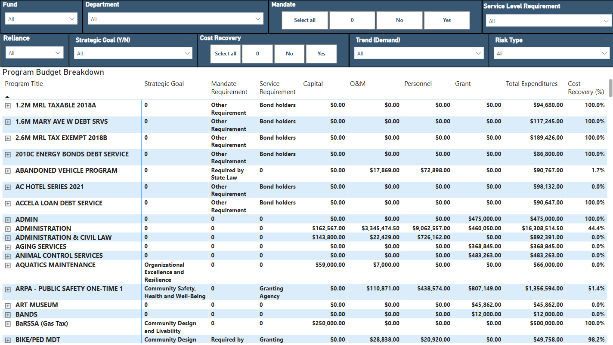

# 🏛️ City of Missoula Budget Capstone Project 🏛️


## Project Overview
This repository contains the capstone project for the City of Missoula Finance Department, supported by Mayor Andrea Davis. The goal is to enhance the City's priority-based budgeting and program transparency through structured data cleaning and the creation of a centralized Power BI dashboard.

By combining budget data and program-level survey responses, this tool enables better strategic planning and decision-making by elected officials and city leadership.

## Project Structure

The repository is organized as follows: 

```
CityofMissoulaBudgetCapstone/
│
├── assets/                        # Images and app visuals
│   ├── welcome_missoula.jpg 
│   ├── missoula_city_snow.JPG 
│   ├── downtown_river.jpg 
│   └── analyst.jpg 
│
├── cleaned_outputs/              # Finalized data used by the app + dashboard
│   ├── cleaned_expenditure_status.csv
│   └── cleaned_program_inventory.csv
│
├── code/                         # Jupyter notebooks and scripts
│   ├── citydata_01_cleaning.ipynb
│   └── citydata_02_exploratory.ipynb
│
├── data/                         # Raw internal City of Missoula data (ignored)
│   └── *.xlsx
│
├── Budget_Director_App.py        # Streamlit app entry point
├── requirements.txt              # Python dependencies
├── README.md                     # You’re reading it!
└── .gitignore                    # Clean Git tracking
```


## Data Sources and Overview
- FY24_Expenditure_Status.xlsx - Budget account-level data with activity, dpeartment and objective codes. Export from Tyler Edens.
- Program_Inventory_Internal_Data_Collection.xlsx - Survey-based program intake / inventory that includes attributes about specific programming (mandates, trends, risks, etc.) Export from City of Missoula Workiva Instance. 

These files are exported from the City of Missoula's Workiva (Wdesk) instance and financial software accordingly. 

## Methodology

The City of Missoula focuses on priority based budgeting practices. This is essential given that many programs are required by various factors. Because this topic is easily misconstrued it is essential that I define a few of the concepts surrounding terminology used in this project. Below are some key definitions that further explain how we understand both of our datasets; program inventory and expenditure status. 

### Key Definitions
**Program**: City-funded service or function with a 6-digit code, representing a specific output or public-facing activity. 

**Program Description**: Short summary explaining what the program does, why it exists and how it benefits the community. 

**Mandate**: Legally required (federal, state or court-appointed). Does not include contract-based or optional services. 

**Service Requirements (External)**: Rules imposed by external entities (ex., regulatory agencies), even if the program itself isn't mandated.

**Reliance**: Community dependence or risk of disruption if removed from the community. High reliance = wide usage, few alternatives, or critical outcomes. 

**Trend**: Indicates whether the program's demand is growing, stable, declining or evolving due to external factors. 

**Risk**: Assesses potential challenges in the next 1-3 years (ex., funding cuts, staffing issues, legal changes).

**Internal Use**: Data used internally for planning and analysis, but not necessarily shared publicly. 


### Extraction Process
**[Currently in progress of implementation]**
In order to begin a refreshed cycle of visualizing the City of Missoula's Program Inventory data, a City of Missoula employee will download data from both the Workiva Platform (Program Inventory Dataset) and Tyler Edens Platform (Expenditure Status Dataset) beginning January 1, 2024 through the current applicable year. Ensuring the dashboarding tool maintain accuracy for year over year comparisons. In all there will be two files; Expenditure Status and Program Inventory Internal Data Collection. 

These three files will be uploaded into the Sharepoint Site: ***"[Missoula PBI - City Program Inventory Budget Breakdown](https://cityofmissoulagcc.sharepoint.com/sites/MissoulaPBI/CPIBB/Forms/AllItems.aspx)"***. 

From this, the files will automatically undergo a cleaning and transformation process, as elaborated in the following section. 


### 🧹 Cleaning & Transformation Process
All cleaning is conducted in Python using modular, documented functions that support automation and integration with the Power BI Platform. 

#### 🧰 Libraries Used
**pandas, numpy:** Data wrangling

**openpyxl:** Excel file I/O

**janitor:** Header normalization and chaining helpers

**tqdm, re, os, chardet:** Cleaning utilities

*missingno, matplotlib.pyplot:* EDA visual tools

#### 🧪 Steps Summary
**Step 1:** Import Libraries
Grouped by function — standard Python, text parsing, Excel reading, and visualization.

**Step 2:** Define Cleaning Functions
Modular helpers support reuse and clarity:

```
drop_unnamed_columns() ## Removes Excel filler columns

clean_numeric_column() ## Fixes trailing .0 artifacts

clean_identifiers() ## Zero-pads fund/dept/activity codes

expand_multicolumn_headers() ## Converts survey sections like "Mandate" into structured columns

apply_department_and_fund_mappings() ## Human-readable mappings for city codes

strip_whitespace_and_standardize() ## Cleans casing and trailing spaces

remove_trailing_underscores() ## Final polish on column names
```

**Step 3:** Load Raw Files
Reads three Excel exports from SharePoint:

Loads specific sheets (vs. all) for efficiency

Handles encoding and sheet detection using openpyxl

**Step 4:** Expenditure Status Filtering
Removes subtotal/blank rows

Confirms numeric validity

Preserves departmental-level breakdown

**Step 5:** Account Code Decomposition
Breaks out ```account_number``` into:

```
fund_no, ## related to four digit fund code

dept_no, ## related to three digit department code

activity_code, ## related to six digit unique activity codes

object_code, ## related to three digit budget object code

sub_object_code ## related to three digit sub budget object code

```

Handles malformed or missing subcodes (like 0, 00X, or empty strings)

**Step 6:** Program Inventory Header Expansion
Converts wide format survey headers (e.g. "Mandate (E41, H41, E43)") into proper named fields

Uses mapping logic to apply consistent schema

**Step 7:** Clean Program Inventory
Standardizes IDs (```fund, dept_no, activity```)

Applies mappings to department and fund_name

Fills empty responses with "blank" for BI compatibility

**Step 8:** Normalize Column Names
Converts all columns to ```snake_case``` using ```janitor.clean_names()```

Removes trailing _ characters

Applies across both program and revenue workbooks

**Step 9:** Validate Structure

```
missingno.matrix()           ## confirms data completeness

.describe() and .info()      ## checks used on each dataset

```

Spot checks confirm no corrupted rows or null-heavy fields

**Step 10:** Apply Final Mappings
Merges ```dept_map``` and ```fund_map``` for readability

Unmapped entries are labeled "unmapped" for visibility

**Step 11:** Export Cleaned Files
Final files are saved to cleaned_outputs/ for use in:

Power BI Dashboard

Streamlit Hosted Internal Training Tool

Built in future year-over-year reporting features

Exported Outputs:

cleaned_expenditure_status.csv

cleaned_program_inventory.csv

### Streamlit Digital Product: Internal Training Tool
The Streamlit app allows the user to experience what it is like to be included in the budget planning process in the City of Missoula. Whether you are planning to run for city council, mayor or support the city by joining the finance department - This tool educates understanding of budget tradeoffs by allocating funds across Housing, Climate, Equity, and Safety using priority-based budgeting practices.

Explore:
- Understanding how program risks, requirements and mandates reduce available budget
- Understanding how strategic goals align with priority-based budgeting
- Understanding the breakdown of what is included in all of the budgeted costs for a program. 

[Launch App (Streamlit Cloud)](https://mtbudgetdirectorapp25.streamlit.app/)

*View the Full Code:* Budget_Director_App.py

### Power BI Integration
**[Currently in progress, will be adding more information to this section. Currently the process is as below]**

This pipeline is automated directly within Power BI. 

**1. Beginning with the SharePoint Library File Drop**

Raw .xlsx files (Expenditure Status, Program Inventory) are uploaded to the desginated *yellow* SharePoint folder "01_raw_data".


File format "Expenditure_Status.xlsx" for Expenditure Status. 

File Format: "Program_Inventory_Internal_Data_Collection.xlsx" for Program Inventory. 

**NOTE: It is essential that these file names are accurate for the integrity of the data cleaning process. Overwrite existing file when dropping them into the SharePoint Library.**

Once the up to date files are uploaded, step two will automatically begin the extraction, transformation / cleaning process and load the cleaned datasets into the green second folder located in the SharePoint Library. 

**2. Power BI Python Script**

*The Power BI Platform will:* 
- Extract the raw files directly from SharePoint Library
- Transform / Clean both raw data files, executing the same cleaning pipeline that is created here in this repository (/code/citydata_01_cleaning.py). 
- Load the cleaned, in-memory dataframes used for dashboard visualizations into the SharePoint Library 02_cleaned_outputs *green* folder. 

Once this process is complete, the dashboard should update to reflect the new data accordingly. 

**3. No Pre-Clean Required**

Users only need to upload raw files. The cleaning script takes care of the rest - cleaning, mapping, and shaping all the data in real-time. 

#### Dashboard Features

***[Currently in progress, this is how the process will be laid out in the future]***
Power BI will support: 
- Maximum filtering by fiscal year, fund, trend (demand), mandate, service level, risk type, cost recovery, and reliance. 
- Visual Summaries for: 
    - Strategic Goal Alignment
    - Budget by Program and Department
    - Understanding Mandated and Service Level Requirements 
    - Understanding Cost Breakdown by Capital, O&M, Personnel, Grant, Total Expenditures and Cost Recovery (%)




### Exploratory Analysis
The notebook [citydata_02_exploratory.ipynb](code/citydata_02_exploratory.ipynb) dives into the cleaned data to identify patterns, ensure data integrity, and inform both the app and dashboard. This step is essential for validating the success of the cleaning process and surfacing analytical insights before building visualizations.

**Step 1: Load Data**
Both cleaned CSVs are loaded:

cleaned_expenditure_status.csv

cleaned_program_inventory.csv

✅ Column names and data types are verified
✅ Expected shapes: ~2,200 expenditure rows, ~375 program rows
✅ Structure aligns with expectations, no null or corrupted columns

**Step 2: Data Structure and Health Checks**
Used ```info()``` and ```.describe()``` to assess completeness and distributions.

Confirmed all key fields (like ```dept_no, adjusted_appropriation, strategic_goal```) are usable.

Found most columns to be consistent and free of missing data.

Visual null-check:

python
Copy
Edit
import missingno as msno
msno.matrix(df_programs)
This quickly confirms that most columns are complete and suitable for grouping and visualization.

🧾 Step 3: Expenditure Trends
Aggregated adjusted_appropriation by department to highlight high-spend orgs.

Identified which departments are driving the city’s core spending.

python
Copy
Edit
top_depts = df_expend.groupby('department')['adjusted_appropriation'].sum().sort_values(ascending=False)
top_depts.plot(kind='barh')
🟢 Findings: Several departments (e.g. Fire, Police, Public Works) dominate the budget allocation.

📚 Step 4: Strategic Program Review
Explored how many programs aligned with citywide strategic goals

Grouped by strategic_goal_e66_name and risk_e93_type to understand complexity

Example:

python
Copy
Edit
df_programs['strategic_goal_e66_name'].value_counts().head(10)
🟡 Insight: Programs tied to housing and infrastructure were most common among strategic alignments.

🛡️ Step 5: Risk and Mandate Profiles
Evaluated how many programs were mandated and how many were high-risk.

Compared cost/reliance of mandated vs. non-mandated programs.

python
Copy
Edit
sns.countplot(data=df_programs, x='mandate_e41_yn')
sns.countplot(data=df_programs, y='risk_e93_type')
🔴 Risk Areas Identified:

Public health and grant-based programs showed higher exposure.

High personnel costs often correlated with risk-heavy programs.

🧮 Step 6: Program Cost Patterns
Analyzed personnel_g27 vs ftes_h36 to find high-cost, low-staff programs.

Flagged outliers that might require further budgetary scrutiny.

python
Copy
Edit
sns.scatterplot(data=df_programs, x='ftes_h36', y='personnel_g27', hue='risk_e93_type')
💡 Pattern: Some strategic programs consume large personnel budgets without high FTE counts — signals for further review.

✅ Summary of Insights
The cleaning pipeline was validated: no structural errors or major nulls.

Expenditure is concentrated among a few departments and object types.

Strategic goals align closely with staffing patterns.

Risk analysis is a critical lens — high-cost programs often carry operational risks.

The outputs informed both the Streamlit app logic and future Power BI dashboards.

## Requirements
Python 3.9+ and the following libraries: 
streamlit
pandas
matplotlib
seaborn
Pillow

## Feedback Welcome!
If you'd like to adapt this work to your city or department, feel free to fork the repo or reach out. This work is open for public use under civic good licensing. 

---

Would you like me to push this directly to your `README.md` or help insert your real GitHub links?


## Appendicies 

### Appendix 1A: City Program Inventory Internal Data Collection Data Columns (Subject to Confirmation)

1. Fund: Identifies the financial fund supporting the program.
2. Org: Department responsible for the program’s delivery or oversight. 
3. Activity: Code linked to a specific function or financial activity in the City's system.
4. Program Title (H8): The name of the city-funded service or function.
5. Requested Title Change (I9): Suggested updates to program titles, submitted by departments.
6. Department (H6): Label for the department managing the program.
7. FTEs (H36): Full-Time Equivalent employees assigned to the program.
8. Personnel (G27): Budget for salaries, benefits, and direct staff compensation.
9. O&M (G28): Operational costs and maintenance-related expenses.
10. Debt (G29): Costs related to debt service obligations.
11. Grant (G30): Costs related to Grant paid to other organizations.
12. Transfers (G31): Transfers between funds or departments.
13. Captial (G32): Capital expenditures for infrastructure or equipment.
14. Total Expenditures (G33): Sum of all budgeted costs for the program.
15. Cost Recovery (E58, P24): Portion of program costs offset by revenue sources.
16. Description (E12): Written explanation of the program’s purpose and activities.
17. Additional Activities (E20): Notes extra roles, services, or responsibilities.
18. Mandate (E41, H41, E43): Indicates legal requirement, authority, and rationale.
19. Service Level (E47, H47, E49): Describes level of service offered and justification.
20. Reliance & Interdependencies (E53, E55): Captures both community dependence and internal links to other programs.
21. Strategic Goal (E64, E66, E68, E74, E80): Tags which City strategic goals the program supports.
22. Trend (Demand) (E87, E89): Describes changes in demand or usage over time.
23. Risk (E93, E95): Identifies short-term risks and supporting notes.
